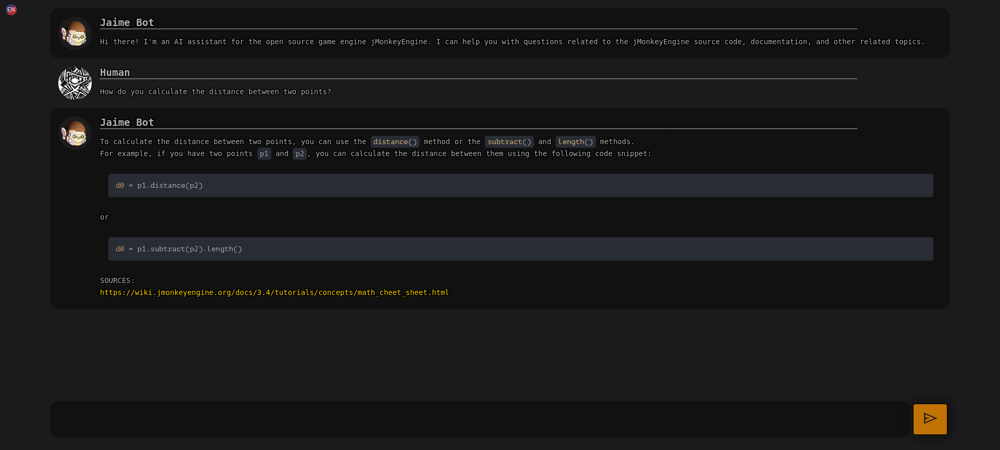

# CHAT-JME




An AI assistant for jMonkeyEngine and related projects.

It knows :
- all the main documentation of jMonkeyEngine and some prominent projects
- the entire source code of the jMonkeyEngine main repo
- how to search the forum for basic queries

For more details, check the [knowledge base](#knowledge-base) section.


## Technologies
To provide the functionality of the bot, the following libraries are used:

- [🦜🔗 LangChain](https://github.com/hwchase17/langchain): to interface with GPT-3
- [🤗 HuggingFace](https://huggingface.co/): inference libraries and models
- [OpenAI apis](https://openai.com/api/): LLM for text generation
- [~~MiniLM L6 v2~~](https://huggingface.co/sentence-transformers/paraphrase-MiniLM-L6-v2): ~~fast embeddings~~
- [all-mpnet-base-v2](https://huggingface.co/sentence-transformers/all-mpnet-base-v2): embeddings 
- [Flan-t5-base-samsum](https://huggingface.co/philschmid/flan-t5-base-samsum): Summarization 
- [Sumy](https://github.com/miso-belica/sumy): Alternative summarization 
- [Yake](https://pypi.org/project/yake/): keywords extraction 
- [LibreTranslate](https://libretranslate.com/): Multi language support and detection
- and more .. Check the [requirements.txt](requirements.txt) and [environment.yml](environment.yml) for the full list.

## Knowledge base
The bot extends the knowledge of GPT-3 by embedding pieces of information from the following sources:

### Static embeddings
Static embeddings are updated periodically and stored in the [embeddings/](embeddings/) folder in this repo.

- [x] [jmonkeyengine.org](https://jmonkeyengine.org) (partial)
- [x] [jMonkeyEngine Wiki](wiki.jmonkeyengine.org) 
- [x] [jMonkeyEngine source code](https://github.com/jMonkeyEngine/jmonkeyengine/) 
- [x] [Minie Wiki](https://stephengold.github.io/Minie/minie) 
- [ ] [Minie source code]() 
- [x] [Lemur Wiki](https://github.com/jMonkeyEngine-Contributions/Lemur/wiki)
- [ ] [Lemur source code]()
- [x] [Zay-ES wiki](https://github.com/jMonkeyEngine-Contributions/zay-es/wiki)
- [ ] [Zay-ES source code]()
- [x] [Monkey-Droid/jme3-Simple-Examples](https://github.com/Monkey-Droid/jme3-Simple-Examples)

### Dynamic embeddings
Dynamic embeddings are generated on the fly for the requested information.

- [x] [jMonkeyEngine Hub](https://hub.jmonkeyengine.org/) (simple search queries based on keywords, cut off: 2023-02-03 )


## Run without docker


1. Install [Miniconda](https://docs.conda.io/en/latest/miniconda.html) or [Anaconda](https://www.anaconda.com/products/individual)
2. Clone this repo and cd into it
3. Create the environment
```bash
conda env create  -f environment.yml
```
4. Activate the environment
```bash
conda activate jmebot
```
5. Install extra dependencies
```bash
pip install -r requirements.txt
```
5b. If you want to run it on a GPU and you have a CUDA compatible GPU, make sure to have a recent version of [CUDA](https://developer.nvidia.com/cuda-downloads) installed and then install the required dependencies 
```bash
# For Ubuntu
sudo apt-get install  build-essential cmake swig libopenblas-dev libpcre3-dev
bash installForCuda.sh # Install the required dependencies (note: this builds faiss-gpu from source, so it will take a while)
```
6. Export your OpenAI API key
```bash
export OPENAI_API_KEY="XXXXX"
```
7. Tweak the config.json file, if you want to run it on a CPU you should change DEVICE to "cpu" and USE_SUMY to true)
8. Run the bot
```bash
bash bot.sh
```
or regenerate the embeddings
```bash
bash bot.sh ingest
```


## Usage with Docker

In a docker host


### Build (optional)
The snippets below show how to use the prebuild images on github registry,
If you want to build your own image:
```bash
# For cpu
docker build -t chat-jme .

# For cuda
docker build -t chat-jme:cuda . -f Dockerfile.cuda
```

### Run
```bash
mkdir -p /srv/chat-jme/cache
chown -Rf 1000:1000 /srv/chat-jme/cache 

# For CPU
docker run -d --restart=always \
-eOPENAI_API_KEY="XXXXXXXX" \
-v/srv/chat-jme/cache:/home/nonroot/.cache \
-p8080:8080 \
--name="chat-jme" \
ghcr.io/riccardobl/chat-jme/chat-jme:snapshot bot

# For Cuda (recommended)
GPUID="device=GPU-XXXXX"
docker run -d --restart=always \
-eOPENAI_API_KEY="XXXXXXXX" \
-v/srv/chat-jme/cache:/home/nonroot/.cache \
-p8080:8080 \
--gpus $GPUID
--name="chat-jme" \
 ghcr.io/riccardobl/chat-jme/chat-jme:cuda-snapshot bot
```

*NOTE: To use custom static embeddings specify the INDEX_PATH environment variable*

*NOTE2: the first run might take some time since it has to download the models.*

*NOTE3: If you use the cpu you might need to add --security-opt seccomp=unconfined to the docker command if performances are bad (note that this is not recommended)*


### Rebuild/update static embeddings
```bash
mkdir -p /srv/chat-jme/cache
chown -Rf 1000:1000 /srv/chat-jme/cache 

mkdir -p /srv/chat-jme/embeddings
chown -Rf 1000:1000 /srv/chat-jme/embeddings

docker run -d --restart=always \
-eOPENAI_API_KEY="XXXXXXXX" \
-eINDEX_PATH="/embeddings" \
-v/srv/chat-jme/cache:/home/nonroot/.cache \
-v/srv/chat-jme/embeddings:/embeddings \
--name="chat-jme" \
ghcr.io/riccardobl/chat-jme/chat-jme:snapshot ingest
```


## API


### Create maintain a session (should be called periodically)
**POST** /session

REQUEST
```json
{
    "sessionSecret":"", // sessionSecret of the session to maintain or nothing to create a new one
    "lang":"en" // || "it" || etc... || "auto",    
}
```
RESPONSE
```json
{
    "sessionSecret":"XYZ", // sessionSecret of the session
    "helloText":"???", // Text that can be used to initiate a conversation with the bot (in the chosen language)
    "welcomeText": "..." // Hardcoded welcome text in the specified language
}
```

### Ask something
**POST** /query

REQUEST
```json
{
    "sessionSecret":"",
    "lang":"en",// || "it" || etc... || "auto",
    "question":"Your question"
}

```
RESPONSE
```json
{
    "output_text":"???" // Answer to the question
}
```

### List all supported languages
**GET** /lang

RESPONSE
```json
[
    {
        "name":"English",
        "code":"en"
    },
    {
        "name":"Italian",
        "code":"it"
    },
    ...
]
```


## Frontend usage and configuration

The frontend is server on the 8080 port by default.
It supports some configuration parameters that can be passed as document hash parameters.
Multiple parameters can be concatenated with the `&` character.

- **lang** the language for questions and answers. (default: en, use auto to get the bot to detect the language automatically)
- **compact** if true, the bot will be displayed in a compact mode, good for embedding (default: false)

 
